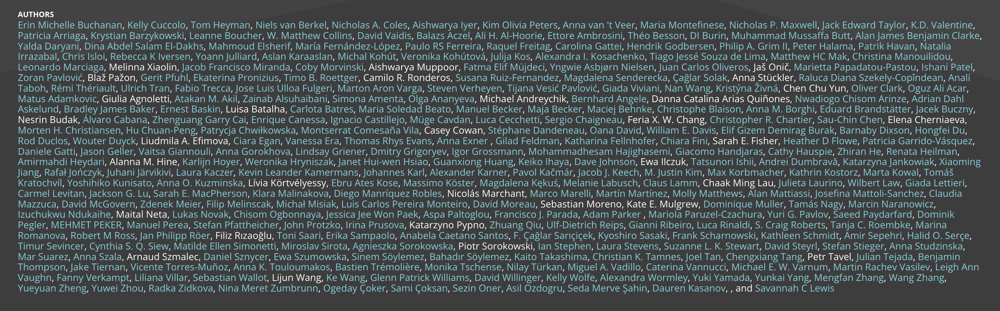
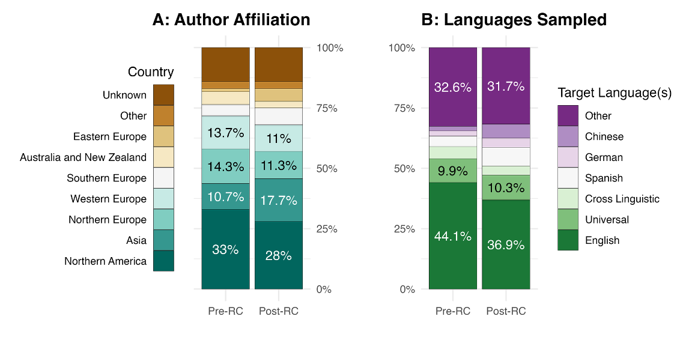
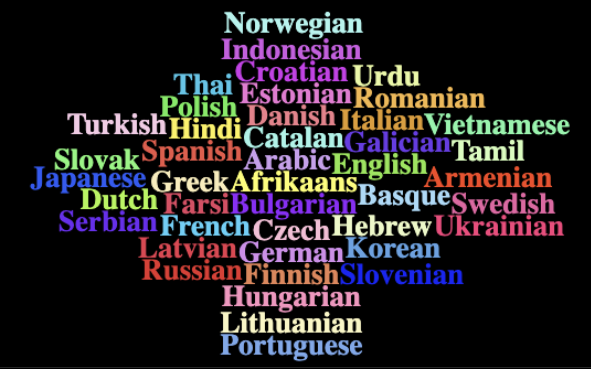
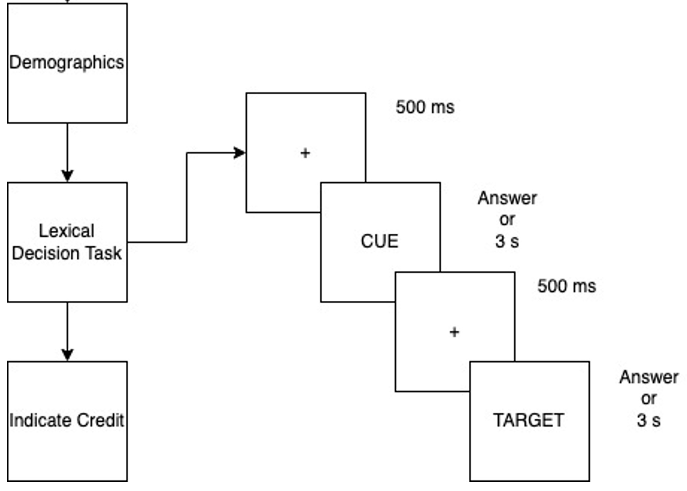
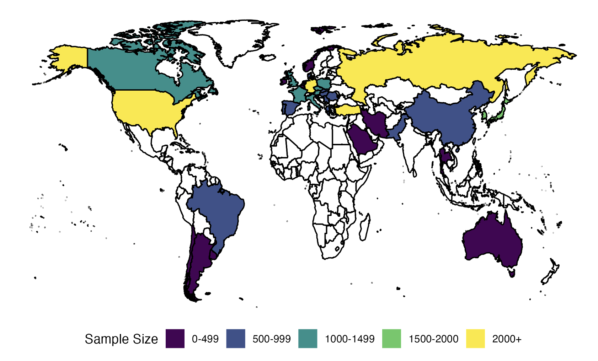
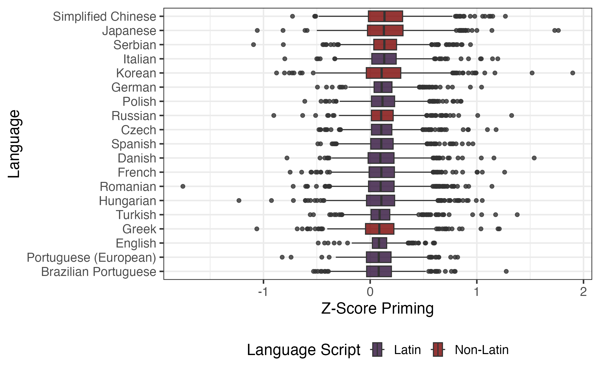
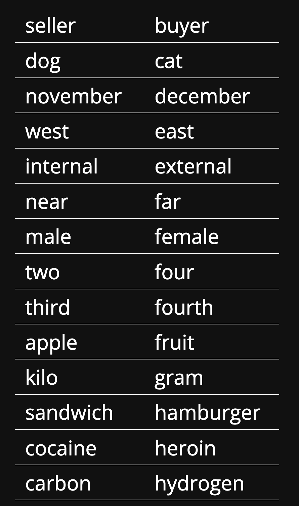
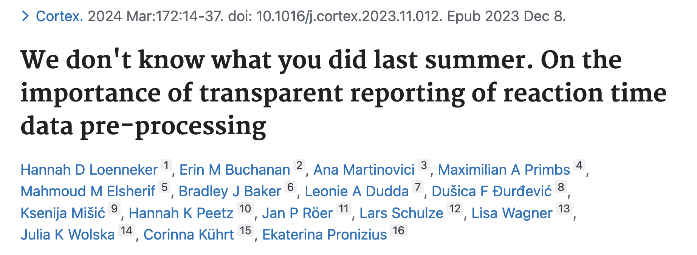
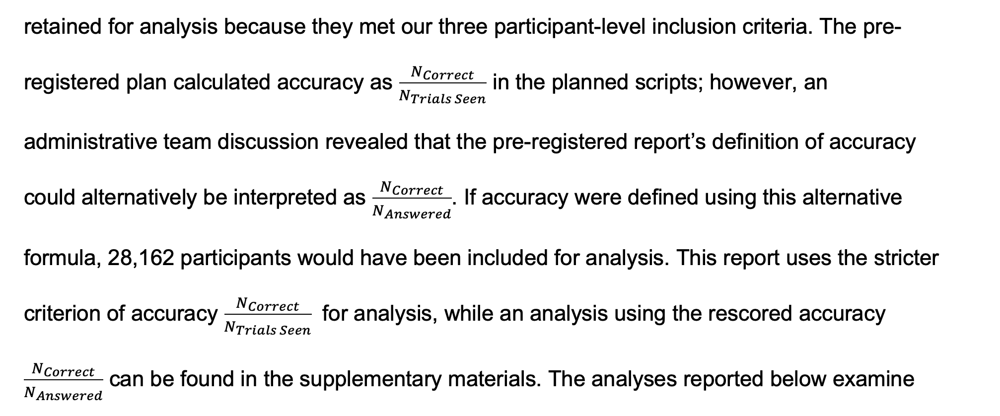
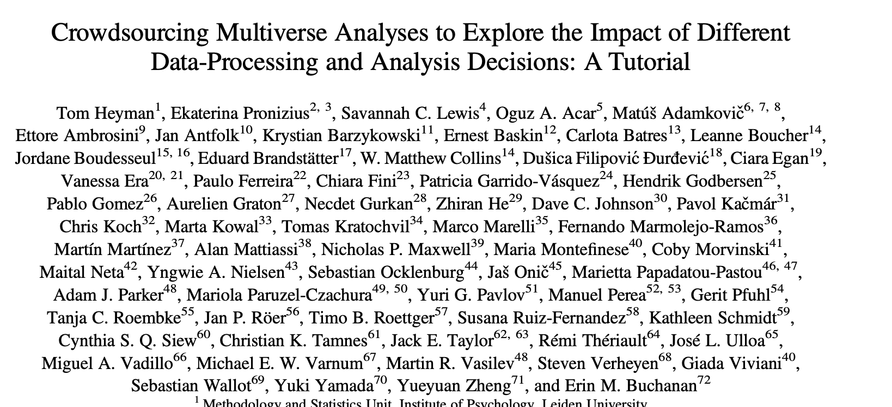

## Outline {.smaller}

-   SPAML Background
-   Researcher Degrees of Freedom + Multiverse
-   Processing Pipeline for Priming

## Many Thanks {.smaller}

```{css}
h1.title {
font-size: 1.5em;
}
```

```{r setup, include=FALSE}
knitr::opts_chunk$set(echo = FALSE)
library(ggplot2)
library(dplyr)
library(knitr)
library(wordcloud2)
library(patchwork)
```

::::: columns
::: {.column width="50%"}
<center>

```{r out.width="100%"}

```

```{r out.width="60%"}

```

</center>
:::

::: {.column width="50%"}
<center>

```{r out.width="100%"}


```

</center>
:::
:::::

## The SPAML Project {.smaller}

-   *Scope*:
    -   A global big-team science study on **semantic priming across many languages (SPAML)**
-   *Goals*:
    -   Create a large-scale, multilingual priming dataset
    -   Test whether the priming effect replicates across cultures and languages
    -   Compare similarities and differences across languages

## Why SPAML Matters {.smaller}

-   Large scale priming datasets are sparse @hutchison2013
-   Cross-linguistic data enables us to critically think about cognitive processes versus linguistic context
-   Datasets are the greatest! @buchanan2019
-   @bochynska2023 shows that linguistics is heavily WEIRD

## Why SPAML Matters {.smaller}



## SPAML Stimuli {.smaller}

-   Selected by language word frequency and similarity using Open Subtitles
-   1000 cue-target pairs
-   Matched across languages - soon to be 45 *thanks to the National Science Foundation*

```{r eval = F}
langs <- data.frame(
  word = c("Afrikaans", "Arabic", "Bulgarian", "Catalan", "Czech", "Danish", "German", "Greek", "English", "Spanish", "Estonian", "Basque", "Farsi", "Finnish", "French", "Galician", "Hebrew", "Hindi", "Croatian", "Hungarian", "Armenian", "Indonesian", "Italian", "Japanese", "Korean", "Lithuanian", "Latvian", "Dutch", "Norwegian", "Polish", "Portuguese", "Romanian", "Russian", "Slovak", "Slovenian", "Serbian", "Swedish", "Tamil", "Thai", "Turkish", "Ukrainian", "Urdu", "Vietnamese", "Simplified Chinese", "Traditional Chinese"),
  freq = rep(1,45)
)
  
wordcloud2(data = langs, 
           minRotation = 0, 
           maxRotation = 0,
           minSize = 1,
           size = .15, 
           color = "random-light",
           backgroundColor = "black",
           shape = "square")
```



## SPAML Procedure {.smaller}

<center>

```{r out.width="75%", out.height="75%"}

```

</center>

## SPAML Geopolitical Regions {.smaller}

```{r}

```

## The SPAML People {.smaller}

-   *People*:
    -   325 official authors
    -   393 completed at least one credit category
-   *Participants*:
    -   35,904 participants opened the study link
    -   31,645 participants completed one study trial
    -   26,971 were retained for analysis

## The SPAML Words {.smaller}

-   Words with data
    -   101,397 unique word forms
        -   47,144 words
        -   54,509 non-words
-   Words with 50+ answered trials (our minimum requirement)
    -   75,008 unique word forms
        -   35,157 words
        -   40,002 non-words
-   Focus on 19,000 pairs (1000 X 19 languages/dialects)

## Priming: Priming? {.smaller}

```{r}

```

## Priming: What Primed? {.smaller}

-   Total Pairs:
    -   19,000 unique pairs with at least 50 answers on both the related and unrelated condition
    -   14,170 priming pairs “work”
-   Matched Pairs:
    -   32 “work” in every language
    -   947 “work” in half of the languages
    -   All “work” in at least 4/19 languages (dna-fingerprint, dvd-video)

## Priming: What Primed? {.smaller}

{width="444"}

## Research DOF {.smaller}

-   We know that choices a researcher makes can lead to different outcomes @silberzahn2018
-   Researcher degrees of freedom occur at many stages in the project @wicherts2016
-   Occurs across linguistic research @roettger2019 and even with statistical software @hodges2023
-   This study had *many* places that included possible choice points:
    -   Stimuli selection \[corpora used, ways we selected\]
    -   Study design and adaptive sampling
    -   Similarity calculation
    -   Processing / calculation of priming scores
    -   Analysis

## SPAML: Processing Pipeline {.smaller}

-   As part of the registered report, the admin team designed a processing pipeline based on other smart people
    -   Mostly from the Semantic Priming Project @hutchison2013
    -   Based on feedback from other collaborators who asked "why" in the registered report
    -   Small adjustments from reviewer feedback

## RTs: Transparent Reporting {.smaller}

@loenneker2024



## SPAML: Processing Pipeline {.smaller}

+-----------------+---------------+------------------+---------------+
|                 | Participants  | Trials           | Stimuli       |
+=================+===============+==================+===============+
| External Events |               | Duplicate trials | Miscodings    |
+-----------------+---------------+------------------+---------------+
| Fixed           | 18 years      | \< 160 ms        |               |
|                 |               |                  |               |
|                 | 80% accuracy  | \> 3000 ms       |               |
|                 |               |                  |               |
|                 | 100 Trials    | Correct          |               |
+-----------------+---------------+------------------+---------------+
| Data            |               | Z-score 2.5      |               |
|                 |               |                  |               |
|                 |               | Z-score 3.0      |               |
+-----------------+---------------+------------------+---------------+

## SPAML: Processing Pipeline {.smaller}

-   Even when you write a pre-registered plan, sometimes things are not clear



## Multiverse Analysis: A Solution? {.smaller}

@heyman2025



## Multiverse Analysis {.smaller}

-   An analysis in which a researcher may:

    -   "perform *all* analyses across the whole set of alternatively processed data sets corresponding to a large set of reasonable scenarios" @steegen2016

-   Allows for the study of the robustness and sensitivity of the effect of analytic choices on the research results

-   *All* is a bit crazy...

## Research Question {.smaller}

-   Clearly outline the substantive research question
-   Define scope of multiverse
    -   Processing choices (data multiverse)
    -   Analysis choices (model multiverse)
-   Define the goal of the multiverse
    -   Assessing robustness
    -   Examining boundary conditions
    -   Increasing transparency

## Today's Research Question {.smaller}

-   What are the effects of processing choices on German priming?

-   Data Multiverse focusing on pre-processing

-   Assessing robustness

## Other Multiverse Notes {.smaller}

-   Not all combinations make sense together

-   Not accounted for: order effects

    -   Each was examined on the full data and then excluded

    -   Z-scoring was always calculated/excluded at the end

## Possible: Participant Exclusions {.smaller}

| Type         | Explanation         | Options                       |
|--------------|---------------------|-------------------------------|
| Participants | No exclusion\*      | None\*                        |
| Participants | Age\*               | 18 years\*                    |
| Participants | Accuracy            | none, 75%, 80%, 85%           |
| Participants | Number of Trials    | none, 50, 100                 |
| Participants | Performance cut off | 5%, 10% performers            |
| Participants | RT cut off          | Lowest RT variability 5%, 10% |

## Possible: Trial Exclusions {.smaller}

| Type   | Explanation    | Options             |
|--------|----------------|---------------------|
| Trials | No exclusion   | None                |
| Trials | Lower Bound RT | None, 100, 160, 200 |
| Trials | Upper Bound RT | None\*, 3000, 2500  |
| Trials | Z-Score        | None, 2.5, 3.0      |
| Trials | Lower Bound    | 5%, 10% trimming    |
| Trials | Upper Bound    | 5%, 10% trimming    |

## Possible: Stimuli Exclusions {.smaller}

| Type    | Explanation          | Options          |
|---------|----------------------|------------------|
| Stimuli | No exclusion         | None             |
| Stimuli | Accuracy             | None, 25%, 50%   |
| Stimuli | Sample size          | None, 30, 50     |
| Stimuli | Lower Bound Accuracy | 5%, 10% trimming |

## Multiverse Results: All {.smaller}

```{r}
results <- read.csv("multiverse_results.csv") %>% 
  mutate(
    
    # ------------------
    # Participant labels
    # ------------------
    P_label = recode(P_type,
      "none" = "None",
      "accuracy" = "Acc",
      "performance" = "Perf",
      "accuracy+numtrials" = "Acc + N",
      "accuracy+rtvar" = "Acc + RTvar",
      "performance+numtrials" = "Perf + N",
      "performance+rtvar" = "Perf + RTvar"
    ),
    
    # ------------------
    # Trial labels
    # ------------------
    T_label = recode(T_type,
      "none" = "None",
      "bounds_rt" = "RT Bounds",
      "bounds_percent" = "RT %",
      "bounds_rt+z" = "RT + Z",
      "bounds_percent+z" = "% + Z"
    ),
    
    # ------------------
    # Stimulus labels
    # ------------------
    S_label = recode(S_type,
      "none" = "None",
      "accuracy" = "Acc",
      "lower_bound_accuracy" = "Acc Trim",
      "accuracy+sample" = "Acc + N",
      "lower_bound_accuracy+sample" = "Trim + N"
    )
  ) %>% 
  mutate(
    P_label = factor(P_label, levels = c(
      "None", "Acc", "Perf",
      "Acc + N", "Acc + RTvar",
      "Perf + N", "Perf + RTvar"
    )),
    
    T_label = factor(T_label, levels = c(
      "None", "RT Bounds", "RT %",
      "RT + Z", "% + Z"
    )),
    
    S_label = factor(S_label, levels = c(
      "None", "Acc", "Acc Trim",
      "Acc + N", "Trim + N"
    ))
  )

spec_curve <- results %>%
  arrange(mean_priming_z) %>%
  mutate(
    spec_id = row_number(),
    se = sd_priming_z / sqrt(n_targets),
    ci_low = mean_priming_z - 1.96 * se,
    ci_high = mean_priming_z + 1.96 * se,
    sign_group = case_when(
      ci_high < 0 ~ "negative",
      ci_low > 0 ~ "positive",
      TRUE ~ "neutral"
    )
  )
```

```{r}
ggplot(spec_curve, aes(x = spec_id, y = mean_priming_z)) +
  # Light confidence intervals
  geom_errorbar(
    aes(ymin = ci_low, ymax = ci_high),
    width = 0,
    alpha = 0.15,
    color = "gray"
  ) +
  # Points on top
  geom_point(
    alpha = 0.6,
    size = 1.4,
    color = "#2C7BB6"
  ) +
  geom_hline(yintercept = 0, linetype = "dashed") +
  labs(
    x = "Specification (ordered)",
    y = "Mean Priming (Z)",
    title = "Specification Curve With 95% Confidence Intervals"
  ) +
  theme_minimal(base_size = 16) +
  theme(
    plot.title = element_text(face = "bold"),
    panel.grid.minor = element_blank()
  )
```

## Multiverse Results: Participant {.smaller}

```{r}
p_top <- ggplot(spec_curve,
                aes(spec_id, mean_priming_z, color = sign_group)) +
  geom_errorbar(
    aes(ymin = ci_low, ymax = ci_high),
    width = 0,
    alpha = 0.1
  ) +
  geom_point(size = 1.3) +
  scale_color_manual(
    values = c(
      negative = "#D7191C",   # red
      neutral  = "grey75",    # white/grey
      positive = "#2C7BB6"    # blue
    )
  ) +
  geom_hline(yintercept = 0, linetype = "dashed") +
  labs(
    y = "Mean Priming (Z)",
    x = NULL
  ) +
  theme_minimal(base_size = 16) +
  theme(
    axis.text.x = element_blank(),
    axis.ticks.x = element_blank(),
    legend.position = "none"
  )

p_bottom <- ggplot(spec_curve,
                   aes(spec_id, P_label)) +
  geom_point(size = 1.2, color = "black", alpha = .7) +
  labs(
    x = "Specification (ordered)",
    y = "Participant Rule"
  ) +
  theme_minimal(base_size = 13) +
  theme(
    legend.position = "none"
  )

p_top / p_bottom + plot_layout(heights = c(2.5, 1))
```

## Multiverse Results: Trials {.smaller}

```{r}
p_bottom <- ggplot(spec_curve,
                   aes(spec_id, T_label)) +
  geom_point(size = 1.2, color = "black", alpha = .7) +
  labs(
    x = "Specification (ordered)",
    y = "Trial Rule"
  ) +
  theme_minimal(base_size = 13) +
  theme(
    legend.position = "none"
  )

p_top / p_bottom + plot_layout(heights = c(2.5, 1))
```

## Multiverse Results: Stimuli {.smaller}

```{r}
p_bottom <- ggplot(spec_curve,
                   aes(spec_id, S_label)) +
  geom_point(size = 1.2, color = "black", alpha = .7) +
  labs(
    x = "Specification (ordered)",
    y = "Stimuli Rule"
  ) +
  theme_minimal(base_size = 13) +
  theme(
    legend.position = "none"
  )

p_top / p_bottom + plot_layout(heights = c(2.5, 1))
```

## Multiverse Results: Combinations {.smaller}

```{r}
heat_data <- results %>%
  group_by(P_label, T_label, S_label) %>%
  summarise(
    mean_effect = mean(mean_priming_z),
    .groups = "drop"
  )

ggplot(heat_data,
       aes(x = T_label,
           y = P_label,
           fill = mean_effect)) +
  
  geom_tile() +
  
  scale_fill_gradient2(
    low = "#D7191C",
    mid = "white",
    high = "#2C7BB6",
    midpoint = .12
  ) +
  
  facet_wrap(~ S_label) +
  
  labs(
    x = "Trial Rule",
    y = "Participant Rule",
    fill = "Mean Priming (Z)",
    title = "Three-Way Multiverse Heatmap"
  ) +
  
  theme_minimal(base_size = 15) +
  theme(
    axis.text.x = element_text(angle = 45, hjust = 1),
    strip.text = element_text(face = "bold")
  )
```

## Final Thoughts {.smaller}

-   Priming effects in German are robust
    -   The priming effect remains positive
    -   Magnitude varies slightly
-   Preprocessing matters but it's not arbitrary
    -   "None" decisions show more variability
-   Multiverse analysis can be a diagnostic tool

## Final Thoughts {.smaller}

-   Rather than defending one preprocessing pipeline as "correct", we can show that the theoretical claim survives across many reasonable ones

## We Want You! {.smaller}

-   SPAML Part 2 was funded!
-   We are collecting data on:
    -   Priming
    -   Age of Acquisition, Imageability, Familiarity, Valence, Arousal, and Concreteness
    -   For words not covered by current data
-   Please join us!

## References {.smaller}
